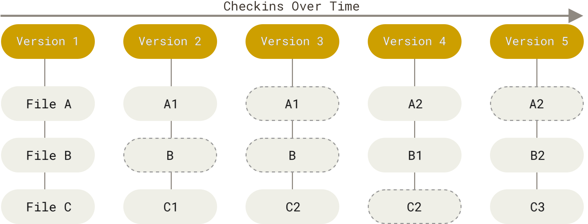
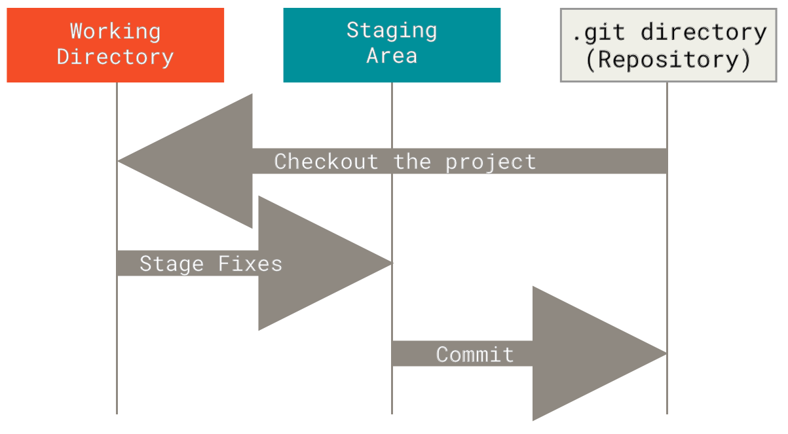
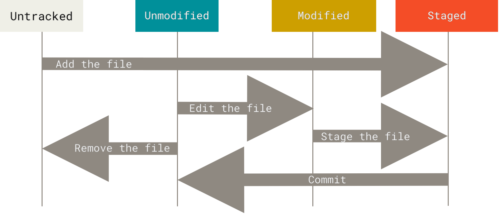
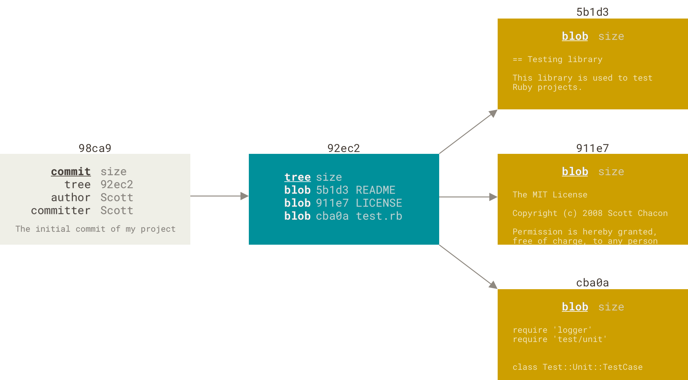
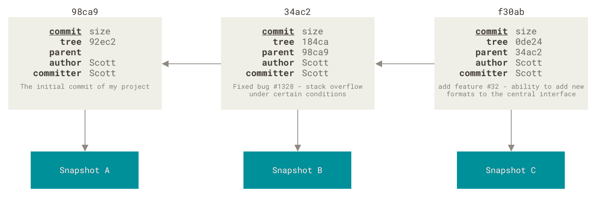
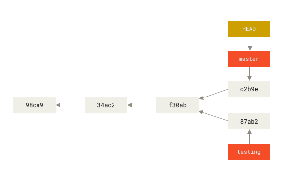
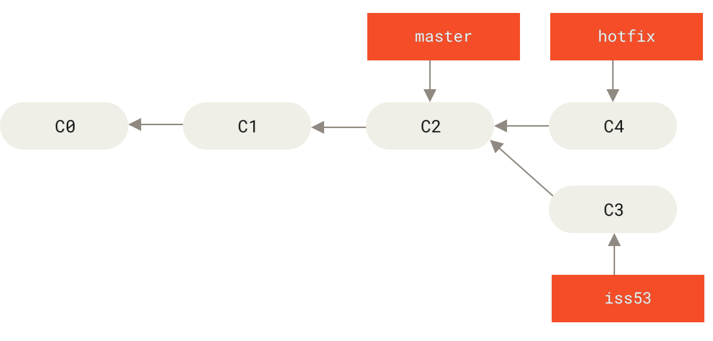
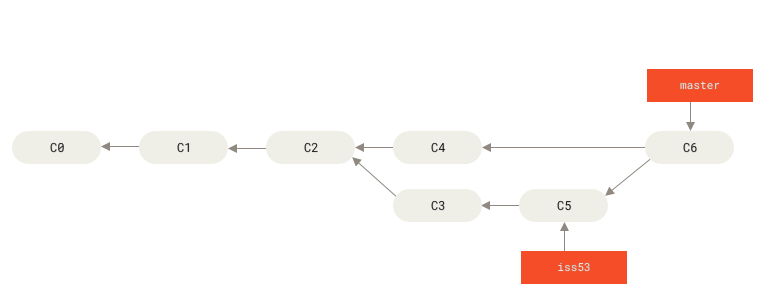

---
title: "Git Info"
keywords:
  - Github
  - Git
...

Based on the [Git Book](https://git-scm.com/book/en/v2/), which has a [cheat sheet](https://git-scm.com/cheat-sheet).

# How Git Works

Git is a versioning control system (VCS) that stores snapshots of the project directory over time as changes are saved. Other VCS store delta files.

Snapshots are all stored locally and Git works as a mini file system with version control as a powerful feature. This lets you keep everything local or remote. Git (generally) only adds data. It tracks file versions by pointing to specific snapshots as such: 


Everything in git is checksummed using SHA-1 (a 40 character hexadecimal) and files are from then on referred to by this (blobs). Git does this for _everything_. So it's very hard for git to miss any change or error without telling you. Files with the same exact content result in identical blobs, and so git only tracks files that were changed in your git project.

## Git's Stages

Files can be in 3 states:
- Modified -> file changed but not yet committed to database.
- Staged -> file in current version (when git added) is ready to go in the next commit.
- Committed -> file is safely part of the local database.

Visual aid depicting working tree.

The working tree is where files get changed. This is a single checkout of the project. The staging area is a file system which marks files that you have staged, they will go into the repository once committed.

## Tracking Files, Changes and Commits



Between the working tree and staging a few things happen. Newly added or removed files will be "untracked" which means git sees a file it doesn't know what to do with - it wont track changes until it is staged, or added to .gitignore etc.

To stage a file use:
```bash
git add [FILENAME]
```
This stages a file in the current version, if any changes are made it needs to be added again. Use ```git status``` (add -s or --short) to check how things are looking.

To stage everything that was changed use (in repository root):
```bash
git add .
```
Where "." means the current directory.

### .gitignore

Used to ignore files that live in the repo - e.g. files containing private passwords, sensitive info or API keys that we dont want others seeing. Standard Glob patterns are supported.

Rules and patterns for .gitignore files:

* Blank lines or lines starting with `#` are seen as comments to .gitignore files.
* Standard glob patterns work, and will be applied recursively throughout the entire working tree.
* You can start patterns with a forward slash (`/`) to avoid recursivity (only ignore those in current dir and not any subdirs).
* You can end patterns with a forward slash (`/`) to specify a directory (i.e. only in this directory ignore).
* You can negate a pattern by starting it with an exclamation point (`!`).

Example of a .gitignore and useful patterns:
```gitignore
# ignore all .a files
*.a

# but do track lib.a, even though you're ignoring .a files above
!lib.a

# only ignore the TODO file in the current directory, not subdir/TODO
/TODO

# ignore all files in any directory named build
build/

# ignore doc/notes.txt, but not doc/server/arch.txt
doc/*.txt

# ignore all .pdf files in the doc/ directory and any of its subdirectories
doc/**/*.pdf

# ignore all files ending in .psd or .dat
*.[psddat]
```
### Getting to a commit

As we saw, ```git add``` stages files, we can see what has changed with the status command, but ```git diff``` is more in depth - shows specifically what has changed in files. Specifically, it highlights changes between whats in your working directory and the staging area.

If you want to see what you’ve staged that will go into your next commit, you can use `git diff --staged`. This command compares your staged changes to your last commit:
```
$ git diff --staged
diff --git a/README b/README
new file mode 100644
index 0000000..03902a1
--- /dev/null
+++ b/README
@@ -0,0 +1 @@
+My Project
```
It’s important to note that `git diff` by itself doesn’t show all changes made since your last commit — only changes that are still unstaged. If you’ve staged all of your changes, `git diff` will give you no output.

```$ git commit``` 
Adds the staged changes to the working directory. It launches an editor by default but this can be skipped by adding -m and typing your commit message. You can also skip the staging area by doing so:
```console
$ git commit -a -m 'Add new benchmarks'
```
The -a file tracks all untracked files by default.

### Removing Files

```git rm```  straight up removes a file. 
Using ```$ git rm --cached filename``` removes a file from the staging area but keeps the file in the working directory.

## Detective Work & Fixing Mistakes
### git log

```$ git log``` 
or
```$ git log --pretty=format:"%h - %an, %ar : %s"```

Shows the commit history. Add --graph for a nice graph also. The --since=2.weeks is also useful to limit the output.
```console
$ git log -S function_name
```
This log call shows any commits which changes the string referenced after -S.

Here's a more useful table:
 
| Option | Description |
| --- | --- |
| `-<n>` | Show only the last n commits. |
| `--since`, `--after` | Limit the commits to those made after the specified date. |
| `--until`, `--before` | Limit the commits to those made before the specified date. |
| `--author` | Only show commits in which the author entry matches the specified string. |
| `--committer` | Only show commits in which the committer entry matches the specified string. |
| `--grep` | Only show commits with a commit message containing the string. |
| `-S` | Only show commits adding or removing code matching the string. |
 
### undoing things

If you commit too early and still have other changes - you can use the amend argument for your commit. Any changes you make should be staged, and when
```
$ git commit --amend
```
is run, it takes your staging area and adds it to the commit. If run without and changes, only the commit message changes. This helps keep commits clean and not cluttered. Also!! **Only amend local commits** or you will have issues.

To unstage a staged file, we can use
```
$ git restore --staged [FILENAME]
```
If you want to discard changes you've made to a file, you should use just the regular
```
$ git restore [FILENAME]
```
**!! BE WARNED!!** This permanently discards changes made in the file. You **WILL NOT** get them back short of forensic data recovery.

### See your remotes
```
$ git remote -v
```
Git remote shows the remote server's nicknames (-v adds the url) of the servers you've cloned from. A repo with multiple working remotes will all show up. The git clone op automatically assigns the origin nickname when cloned. You can use:
```
$ git remote show origin
```
to get a lot more info on a remote repo, like:
```console
$ git remote show origin
* remote origin
  Fetch URL: https://github.com/schacon/ticgit
  Push  URL: https://github.com/schacon/ticgit
  HEAD branch: master
  Remote branches:
    master                               tracked
    dev-branch                           tracked
  Local branch configured for 'git pull':
    master merges with remote master
  Local ref configured for 'git push':
    master pushes to master (up to date)
```
### Rename and Remove Remotes
After remotes are added with git remote origin add <url>. You can rename and remove like:
```console
$ git remote rename pb paul
$ git remote
origin
paul
```
Git tracks these changes.

To remove:
```console
$ git remote remove paul
$ git remote
origin
```


### Fetch and Push
**Fetch** remote data using below command. This only downloads the data, so you'll need to merge it yourself for the changes to be reflected in your working repo.
```
$ git fetch <remote> # no <remote> arg just uses the origin or server youve cloned from
```
Instead, use to simultaneously fetch and merge.
```
$ git pull
``` 
Once changes are made that you're ready to push back from local to remote you should use:
```
$ git push <remote name> <branch name>
# i.e.
$ git push origin master
```
## Aliases (Make life easier)
They're just custom git commands that do a few things you tell them to do, e.g.:
```console
$ git config --global alias.co checkout
$ git config --global alias.br branch
$ git config --global alias.ci commit
$ git config --global alias.st status
```
So typing git ci commits your work. Its useful for making stuff like unstaging a file or viewing only the last commit with log faster - e.g.: 
```console
$ git config --global alias.last 'log -1 HEAD'
```
Shows the last commit.

# Branches

View your branches with:
```$ git branch```

## Histories

Git's use of snapshots, checksums and pointers makes branches quick and easy to use. Lets imagine three files were placed into a new repo. It has 5 objects:

- Files 1-3 (stored as blobs)
- Tree which lists the directory and which filenames are which blobs
- Commit with a pointer to the tree and commit metadata.

Making changes and commiting again makes a new snapshot and commit item which points to it's parent - the commit that came before it. Remember the blue ones are trees.


## Making and Switching Branches
To make a new branch, you just use
```
git branch <branch name>
```
This makes a new branch but does not switch to it, you need to use ```git checkout <branch name>``` to switch branches. This just moves the ```HEAD``` pointer to the current branch. Git uses this pointer to keep track of which branch is currently being used.

To make a new branch and switch at the same time: ```$ git checkout -b <name>```

Any work done on a branch will move it forward one commit, and leave others untouched. Editing and pushing to two branches moves them forward separately. This makes a divergent history.

You can see the commit history (checksums as hex) and also the branch they come from, and what the current branch is.

## Merging Branches

We have x3 branches here, issue 53, hotfix and master. Branch iss53 has a separate commit, to hotfix. Once we are ready to merge hotfix back, we switch to master and use merge.
```console
$ git checkout master
$ git merge hotfix
Updating f42c576..3a0874c
Fast-forward
 index.html | 2 ++
 1 file changed, 2 insertions(+)
```
This moves the master pointer to the same place as hotfix. The old branch can now be deleted with ```$ git branch -d hotfix```. Say iss53 has another commit, and then is merged. Git sees a common ancestor (c2) and merges iss53 with master by creating a new snapshot like so, which is called a merge commit.


## Merge Conflicts
If two different branches change the same part of the same file, git is not sure which branch should take precedence over the other, and does not know which branches version of the line which both branches edit. This looks like:
```console
$ git merge iss53
Auto-merging index.html
CONFLICT (content): Merge conflict in index.html
Automatic merge failed; fix conflicts and then commit the result.
```
Reading more from status:
```console
$ git status
On branch master
You have unmerged paths.
  (fix conflicts and run "git commit")

Unmerged paths:
  (use "git add <file>..." to mark resolution)

    both modified:      index.html

no changes added to commit (use "git add" and/or "git commit -a")
```
We see both branches edit index.html at the same place, when git sees a conflict, it edits the file to show both branches version of the line like so:
```html
<<<<<<< HEAD:index.html
<div id="footer">contact : email.support@github.com</div>
=======
<div id="footer">
 please contact us at support@github.com
</div>
>>>>>>> iss53:index.html
```
The top part is the one you are merging into, and the bottom is the branch you are merging in. Resolve the conflict by just fixing the file and removing the <<<< ==== and >>>>. You then need to stage and commit to complete the merge.